<h1 align="center">VSD Squadron — RTL Design & Synthesis Assessment</h1>

<p align="center">
  <b>12-Hour Hands-On Assessment: RTL Simulation, Logic Synthesis & Standard Cell Mapping<br/>using Icarus Verilog, GTKWave, Yosys & SkyWater 130nm PDK</b>
</p>

<p align="center">
  <a href="#module-1-rtl-simulation--logic-synthesis"></a>
  <a href="#module-2-timing-libraries-hierarchical-synthesis--flop-coding-styles"></a>
</p>

<p align="center">
  
  
  
  
  
</p>

---

## 📋 Table of Contents

- [About This Assessment](#about-this-assessment)
- [Why Each File Type Matters](#-why-each-file-type-matters)
- [Environment & Toolchain](#-environment-setup--toolchain)
- [Design File Index](#-design-file-index)
- [Module 1: RTL Simulation & Logic Synthesis](#module-1-rtl-simulation--logic-synthesis)
  - [Lab 1 — 2:1 MUX: Simulation & Waveform Analysis](#lab-1--21-mux-simulation--waveform-analysis)
  - [Lab 2 — Synthesis Theory: RTL-to-Netlist Flow](#lab-2--synthesis-theory-rtl-to-netlist-flow)
  - [Lab 3 — Yosys Synthesis with Sky130 PDK](#lab-3--yosys-synthesis-with-sky130-pdk)
- [Module 2: Timing Libraries, Hierarchical Synthesis & Flop Coding Styles](#module-2-timing-libraries-hierarchical-synthesis--flop-coding-styles)
  - [Lab 4 — Exploring the Sky130 Liberty File](#lab-4--exploring-the-sky130-liberty-file)
  - [Lab 5 — Hierarchical vs. Flat Synthesis](#lab-5--hierarchical-vs-flat-synthesis)
  - [Lab 6 — Flip-Flop Coding Styles & Special Optimizations](#lab-6--flip-flop-coding-styles--special-optimizations)
- [Key Learnings & Observations](#-key-learnings--observations)
- [Synthesis vs. Simulation — A Deep Comparison](#️-synthesis-vs-simulation--a-deep-comparison)
- [Acknowledgements](#-acknowledgements)

---

## About This Assessment

This repository documents the complete output of a **12-hour hands-on RTL Design and Synthesis assessment** conducted as part of the **VSD (VLSI System Design) Squadron Internship**. The lab covers the full ASIC front-end design flow:

- **RTL Coding** — Writing synthesizable Verilog HDL code to describe the intended behavior of the hardware design
- **Functional Simulation** — Compilation of the design and testbench using Icarus Verilog followed by generation of Value Change Dump (`.vcd`) files
- **Waveform Analysis** — Viewing the `.vcd` file in GTKWave for visual inspection and validation of signal transitions
- **Logic Synthesis** — Inputting the RTL code together with the SkyWater SKY130 standard cell library into Yosys to generate a gate-level netlist

| Detail | Description |
|:---|:---|
| **Program** | VSD Squadron Internship — SoC Design & Synthesis |
| **Assessment** | 12-Hour Hands-On Lab (Module 1 + Module 2) |
| **Timeline** | May 2026 |
| **Focus** | RTL Simulation, Logic Synthesis, Timing Libraries, Flop Coding Styles |
| **Tools Used** | Icarus Verilog, GTKWave, Yosys Open Synthesis Suite |
| **Target PDK** | SkyWater SKY130 (`sky130_fd_sc_hd__tt_025C_1v80.lib`) |
| **Platform** | VirtualBox VM (Ubuntu) on VSD-provided image |

> **Key Insight:** RTL Simulation is proof that the RTL "works." RTL Synthesis is proof that the RTL "builds." Both are essential — an RTL can simulate successfully but fail to synthesize due to non-synthesizable constructs (`#delay`, `initial` blocks in DUT, etc.).

---

## 📁 Why Each File Type Matters

Every file extension in this project serves a distinct purpose in the design verification and synthesis flow:

| Extension | Full Name | Role in the Flow | Why We Need It |
|:---|:---|:---|:---|
| `.v` | Verilog Source | RTL Design / Testbench | The primary input — describes hardware behavior in synthesizable Verilog. **Design files** model the circuit; **testbench files** (`tb_*`) generate stimulus. |
| `.vcd` | Value Change Dump | Simulation Output | Records every signal transition with a timestamp. Without this, GTKWave has nothing to display — it bridges simulation and visualization. |
| `.lib` | Liberty File | Standard Cell Library | Contains timing, area, and power data for real foundry cells. Maps abstract RTL operators to physical gates. |
| `.png` | Screenshots | Documentation Evidence | GTKWave waveform captures and Yosys schematics serve as **visual proof** of correct behavior and synthesis topology. |

```
design.v + tb_design.v  →  iverilog  →  a.out  →  ./a.out  →  design.vcd  →  GTKWave
design.v                →  Yosys + sky130.lib   →  gate_level_netlist.v  +  schematic
```

---

## 🛠 Environment Setup & Toolchain

All labs were performed on a pre-configured **VSD VirtualBox VM** running Ubuntu, with the following tools pre-installed:

```
┌──────────────────────────────────────────────────────────┐
│                   VSD Lab Environment                     │
├──────────────────────────────────────────────────────────┤
│  OS         :  Ubuntu (VirtualBox VM)                     │
│  Simulator  :  Icarus Verilog (iverilog)                  │
│  Waveform   :  GTKWave                                    │
│  Synthesis  :  Yosys 0.7                                  │
│  PDK        :  SkyWater SKY130 (sky130_fd_sc_hd)          │
│  Workshop   :  sky130RTLDesignAndSynthesisWorkshop        │
└──────────────────────────────────────────────────────────┘
```

### Icarus Verilog (iverilog)
Icarus Verilog is an open-source Verilog compiler. It works in two stages:
- `iverilog -o sim design.v tb_design.v` — compiles both files into a simulation executable
- `./sim` (or `vvp sim`) — runs the simulation and writes the `.vcd` file

> The testbench is **not synthesized** — it exists purely to drive stimulus into the DUT (Device Under Test).

### GTKWave
GTKWave is a waveform viewer that accepts `.vcd` files, allowing engineers to:
- Verify output waveforms toggle correctly based on clock edges
- Confirm asynchronous behavior takes precedence over synchronous behavior
- Check that combinational outputs change instantly upon input change

### Yosys Open Synthesis Suite
Yosys is an open-source RTL synthesis framework. The standard synthesis flow:

```tcl
read_verilog design.v                        # Parse RTL
synth -top module_name                       # High-level synthesis
dfflibmap -liberty sky130.lib                # Map flip-flops to library cells
abc -liberty sky130.lib                      # Map combinational logic (ABC engine)
show                                         # Display schematic
write_verilog -noattr netlist.v              # Write gate-level netlist
```

### SKY130 Standard Cell Library
The SkyWater SKY130 is a 130nm open-source PDK defining real logic cells:
- `sky130_fd_sc_hd__and2_1` — 2-input AND gate
- `sky130_fd_sc_hd__or2_1` — 2-input OR gate
- `sky130_fd_sc_hd__mux2_1` — 2:1 Multiplexer
- `sky130_fd_sc_hd__dfrtp_1` — D Flip-Flop with async Reset
- `sky130_fd_sc_hd__dfstp_1` — D Flip-Flop with async Set

> Using a real PDK means the synthesized netlist reflects **actual silicon area and timing**, not an abstract model.

**Assessment directory structure (on VSD VM):**
```
sky130RTLDesignAndSynthesisWorkshop/
├── my_lib/
│   ├── lib/
│   │   └── sky130_fd_sc_hd__tt_025C_1v80.lib    ← Standard cell library
│   └── verilog_model/
│       └── primitives.v                          ← Sky130 Verilog models
└── verilog_files/
    ├── good_mux.v                                ← RTL design files
    ├── tb_good_mux.v                             ← Testbench files
    ├── multiple_modules.v                        ← Hierarchical designs
    ├── dff_asyncres.v / dff_async_set.v          ← Sequential designs
    ├── dff_syncres.v                             ← Sync reset DFF
    └── mult_2.v / mult_8.v                       ← Arithmetic modules
```

---

## 📑 Design File Index

### Design Source Files
| File | Module Name | Type | Function |
|:---|:---|:---|:---|
| `good_mux.v` | `good_mux` | Combinational | 2:1 Multiplexer — selects between `i0` and `i1` based on `sel` |
| `multiple_modules.v` | `multiple_modules`, `sub_module1`, `sub_module2` | Combinational (Hierarchy) | Top-level module instantiating AND + OR gates as sub-modules |
| `dff_asyncres.v` | `dff_asyncres` | Sequential | D Flip-Flop with **asynchronous reset** (active-high, resets to 0) |
| `dff_async_set.v` | `dff_async_set` | Sequential | D Flip-Flop with **asynchronous set** (active-high, sets to 1) |
| `dff_syncres.v` | `dff_syncres` | Sequential | D Flip-Flop with **synchronous reset** (clocked, resets to 0) |
| `mult_2.v` | `mul2` | Combinational | Multiplies 3-bit input by 2 — synthesizes to **zero logic cells** |
| `mult_8.v` | `mult8` | Combinational | Multiplies 3-bit input by 9 — synthesizes to **zero logic cells** |

### Testbench Files
| File | Tests Module | Sim Duration | Key Stimulus |
|:---|:---|:---|:---|
| `tb_good_mux.v` | `good_mux` | 300 ns | `sel` every 75 ns, `i0` every 10 ns, `i1` every 55 ns |
| `tb_dff_asyncres.v` | `dff_asyncres` | 3000 ns | Clock 20 ns period, `d` every 23 ns, `async_reset` every 547 ns |
| `tb_dff_async_set.v` | `dff_async_set` | 3000 ns | Clock 20 ns period, `d` every 23 ns, `async_set` every 547 ns |
| `tb_dff_syncres.v` | `dff_syncres` | 3000 ns | Clock 20 ns period, `d` every 23 ns, `sync_reset` every 113 ns |

---

## Module 1: RTL Simulation & Logic Synthesis

> **Objective:** Understand the complete RTL-to-Netlist flow — from writing behavioral Verilog, simulating with Icarus Verilog, analyzing waveforms in GTKWave, and synthesizing gate-level netlists using Yosys with the SkyWater 130nm standard cell library.

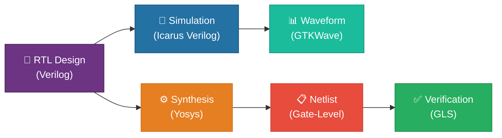

---

### Lab 1 — 2:1 MUX: Simulation & Waveform Analysis

<details>
<summary><b>📖 Theory: What is RTL Design & Simulation?</b></summary>
<br>

**RTL (Register Transfer Level) Design** is the behavioral representation of a digital circuit's required specification, written in a Hardware Description Language (HDL) like Verilog.

**Key Concepts:**
- **Design:** The Verilog code that models the intended hardware functionality
- **Testbench:** A wrapper module that applies stimulus to the design and observes outputs — it is **not synthesizable**
- **Simulator:** Checks the design against its specification by monitoring input/output changes
- **VCD File:** Value Change Dump — records all signal transitions for waveform viewing

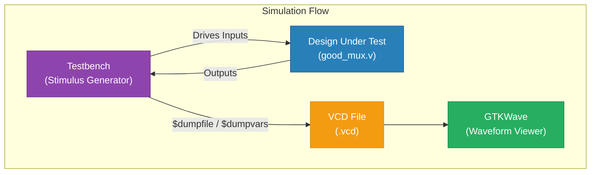

> **Important:** The simulator evaluates changes in input signals. If there is no change in input, there is no change in output — this is **event-driven simulation**.

</details>

---

#### 1.1 Lab: Environment Setup & File Exploration

Navigate to the workshop directory and list all available Verilog design and testbench files:

```bash
cd /home/vsd/VLSI/sky130RTLDesignAndSynthesisWorkshop/verilog_files
ls
```

<p align="center">
  
</p>

> **Observation:** The `verilog_files/` directory contains a comprehensive set of RTL designs (`.v`), their corresponding testbenches (`tb_*.v`), and supporting files. Key files for this lab include `good_mux.v` and `tb_good_mux.v`.

---

#### 1.2 Lab: Simulating a 2:1 MUX using Icarus Verilog

Compile and simulate the `good_mux` design with its testbench:

```bash
# Step 1: Compile the design and testbench
iverilog good_mux.v tb_good_mux.v

# Step 2: Execute the simulation
./a.out
# Output: VCD info: dumpfile tb_good_mux.vcd opened for output.
```

<p align="center">
  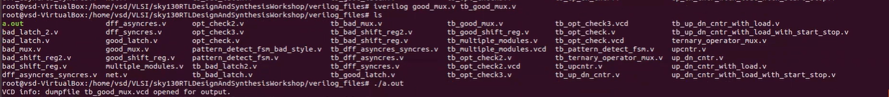
</p>

> **Result:** The simulation produces `tb_good_mux.vcd` — a Value Change Dump file containing all signal transitions, ready for waveform analysis.

---

#### 1.3 Lab: Waveform Analysis using GTKWave

Open the VCD file in GTKWave to visualize signal behavior:

```bash
gtkwave tb_good_mux.vcd
```

<p align="center">
  
</p>

After adding all signals (`i0`, `i1`, `sel`, `y`) to the waveform viewer:

<p align="center">
  
</p>

> **Waveform Analysis:**
> | Signal | Role | Observation |
> |:---|:---|:---|
> | `i0` | Input 0 | Random toggling pattern |
> | `i1` | Input 1 | Random toggling pattern |
> | `sel` | Select line | Toggles between 0 and 1 |
> | `y` | Output | Follows `i0` when `sel=0`, follows `i1` when `sel=1` |
>
> ✅ The waveform confirms correct **2:1 MUX** behavior — the output `y` selects between `i0` and `i1` based on the `sel` signal.

---

#### 1.4 Lab: Understanding the RTL & Testbench Source Code

Examine the source files using `gvim` (or any text editor):

```bash
gvim tb_good_mux.v -o good_mux.v
```

<p align="center">
  
</p>

<details>
<summary><b>📄 RTL Design — <code>good_mux.v</code></b></summary>

```verilog
module good_mux (input i0, input i1, input sel, output reg y);
  always @ (*)
  begin
    if (sel)
      y <= i1;
    else
      y <= i0;
  end
endmodule
```
> A simple combinational 2:1 multiplexer using an `always` block with a sensitivity list of `(*)` — meaning it triggers on **any** input change.
</details>

<details>
<summary><b>📄 Testbench — <code>tb_good_mux.v</code></b></summary>

```verilog
`timescale 1ns / 1ps
module tb_good_mux;
  reg i0, i1, sel;
  wire y;

  // Instantiate the Unit Under Test (UUT)
  good_mux uut (
    .sel(sel), .i0(i0), .i1(i1), .y(y)
  );

  initial begin
    $dumpfile("tb_good_mux.vcd");
    $dumpvars(0, tb_good_mux);
    // Initialize Inputs
    sel = 0; i0 = 0; i1 = 0;
    // Apply stimulus...
  end
endmodule
```
> The testbench instantiates the `good_mux` as UUT, applies stimulus, and dumps waveform data for GTKWave analysis.
</details>

---

### Lab 2 — Synthesis Theory: RTL-to-Netlist Flow

<details>
<summary><b>📖 Theory Deep-Dive: The Complete Synthesis Flow</b></summary>
<br>

#### What is Synthesis?

**Synthesis** is the process of translating an RTL design (behavioral Verilog) into a gate-level netlist — a structural representation using standard cells from a technology library.

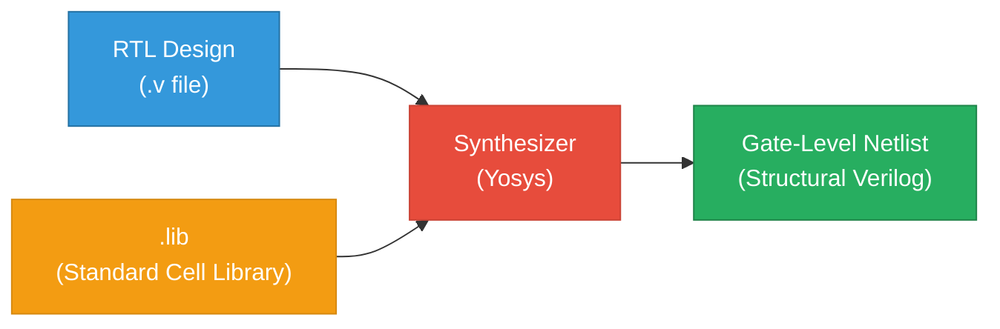

</details>

---

#### 2.1 Theory: What is Synthesis?

Synthesis is the **RTL-to-Gate-Level translation** performed by a synthesizer tool (Yosys). It takes:
- **Input:** RTL design (behavioral Verilog) + Front-end standard cell library (`.lib`)
- **Output:** A **netlist** — the same module re-expressed as interconnected standard cells

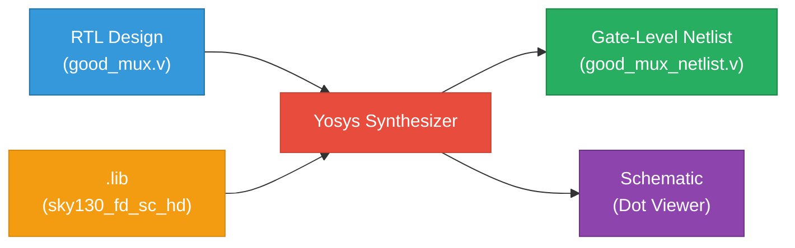

> **Key Insight:** The design is converted into logic gates and their interconnections. The output file (netlist) is functionally equivalent to the original RTL but expressed in terms of actual physical gates from the target technology.

---

#### 2.2 Theory: Understanding .lib & Cell Flavors

**`.lib` (Liberty File)** is a collection of logical modules, including basic gates (AND, OR, NOT, etc.) in **multiple flavors**:

| Gate Type | Variants | Characteristic |
|:---|:---|:---|
| 2-input AND | Slow, Medium, Fast | Different speed/area/power trade-offs |
| 3-input AND | Slow, Medium, Fast | Wider input versions |
| 4-input AND | Slow, Medium, Fast | Even wider variants |
| OR, NOT, etc. | Multiple flavors each | Full combinational library |

> **Why different flavors?** The synthesis tool chooses the optimal cell variant based on timing constraints, power budget, and area targets.

---

#### 2.3 Theory: Faster vs. Slower Cells — The Design Trade-off

In digital circuits, the load seen by a gate is the **capacitance** at its output. The speed of charging/discharging this capacitance determines the delay:

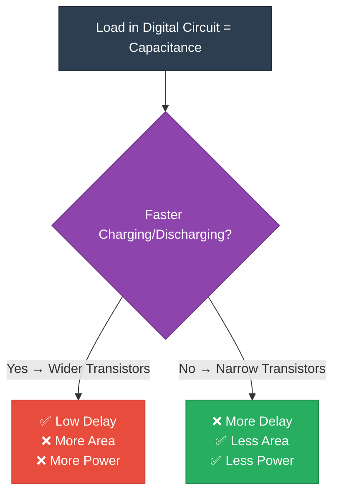

**The fundamental trade-off:**
- **Faster cells** → Wider transistors → More current → Lower delay → **But higher area & power**
- **Slower cells** → Narrow transistors → Less current → Higher delay → **But lower area & power**

> **Why do we need BOTH fast and slow cells?**
> - **Fast cells** are needed to meet **setup time** requirements: `T_setup < T_clk - T_CQ - T_COMBI`
> - **Slow cells** are needed to prevent **hold time** violations: `T_HOLD < T_CQ + T_COMBI`
> - The `.lib` collection provides both variants so the synthesizer can balance these constraints during timing closure.

---

#### 2.4 Theory: Synthesis Verification Flow

After synthesis, the gate-level netlist must be **verified** to ensure functional equivalence with the original RTL:

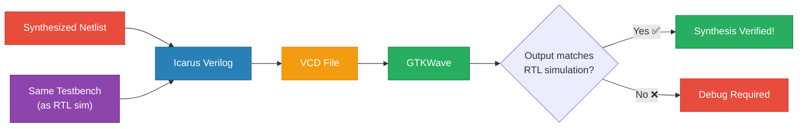

> **Critical Note:** The set of primary inputs and primary outputs remain the **same** between the RTL design and the synthesized netlist. Therefore, the **same testbench** can be reused for Gate-Level Simulation (GLS).

---

### Lab 3 — Yosys Synthesis with Sky130 PDK

> **Objective:** Perform end-to-end logic synthesis of `good_mux.v` using Yosys with the SkyWater 130nm standard cell library, and generate a gate-level netlist mapped to real silicon cells.

---

#### 3.1 Lab: Invoking Yosys & Reading the Liberty File

```bash
# Step 1: Launch Yosys
yosys

# Step 2: Read the Sky130 standard cell library
yosys> read_liberty -lib ../my_lib/lib/sky130_fd_sc_hd__tt_025C_1v80.lib
```

<p align="center">
  
</p>

<p align="center">
  
</p>

> **Result:** Yosys successfully loads the `sky130_fd_sc_hd` library at the **TT corner (Typical-Typical), 25°C, 1.80V** operating conditions. **428 standard cell types** are imported and available for technology mapping.

---

#### 3.2 Lab: Reading Verilog & Running Synthesis

```bash
# Step 3: Read the RTL design
yosys> read_verilog good_mux.v

# Step 4: Synthesize with good_mux as the top module
yosys> synth -top good_mux
```

<p align="center">
  
</p>

<p align="center">
  
</p>

**Synthesis Statistics:**

<p align="center">
  
</p>

| Metric | Value |
|:---|:---|
| Number of wires | 4 |
| Number of wire bits | 4 |
| Number of public wires | 4 |
| Number of public wire bits | 4 |
| Number of memories | 0 |
| Number of processes | 0 |
| **Number of cells** | **1 (`$_MUX_`)** |

> **Observation:** Yosys correctly infers the design as a single **MUX primitive** (`$_MUX_`), which will then be mapped to actual Sky130 standard cells.

After mapping to the technology library:

```bash
# Step 5: Map to Sky130 cells
yosys> abc -liberty ../my_lib/lib/sky130_fd_sc_hd__tt_025C_1v80.lib
```

---

#### 3.3 Lab: Viewing the Synthesized Netlist Schematic

```bash
yosys> show
```

<p align="center">
  
</p>

> **Schematic Analysis:**
> The synthesized `good_mux` is implemented using three Sky130 standard cells:
>
> | Cell Instance | Standard Cell | Function |
> |:---|:---|:---|
> | `$53` | `sky130_fd_sc_hd__clkinv_1` | Clock inverter (inverts `sel`) |
> | `$54` | `sky130_fd_sc_hd__nand2_1` | 2-input NAND gate |
> | `$55` | `sky130_fd_sc_hd__o21ai_0` | OR-AND-Invert (2-1) complex gate |
>
> This implements the MUX function: **y = (sel · i1) + (sel' · i0)** using an optimized gate decomposition.

---

#### 3.4 Lab: Generating & Inspecting the Gate-Level Netlist

```bash
# Generate the Verilog netlist
yosys> write_verilog good_mux_netlist.v

# View the netlist
yosys> !gvim good_mux_netlist.v
```

<p align="center">
  
</p>

<p align="center">
  
</p>

<details>
<summary><b>📄 Generated Gate-Level Netlist — <code>good_mux_netlist.v</code></b></summary>

```verilog
/* Generated by Yosys 0.7 (Sky130 RTL Design & Synthesis Workshop) */

module good_mux(i0, i1, sel, y);
  wire _0_, _1_, _2_, _3_, _4_, _5_;
  input i0, i1, sel;
  output y;

  sky130_fd_sc_hd__clkinv_1 _6_ (
    .A(_0_),
    .Y(_4_)
  );

  sky130_fd_sc_hd__nand2_1 _7_ (
    .A(_1_),
    .B(_2_),
    .Y(_5_)
  );

  sky130_fd_sc_hd__o21ai_0 _8_ (
    .A1(_2_),
    .A2(_4_),
    .B1(_5_),
    .Y(_3_)
  );

  assign _0_ = i0;
  assign _1_ = i1;
  assign _2_ = sel;
  assign y   = _3_;
endmodule
```

</details>

> **Verification:** The netlist is a **structural Verilog** file using instantiated Sky130 standard cells. It is functionally equivalent to the original behavioral RTL and is ready for:
> - Gate-Level Simulation (GLS) using the same testbench
> - Physical design flow (Place & Route)
> - Static Timing Analysis (STA)

---

## Module 2: Timing Libraries, Hierarchical Synthesis & Flop Coding Styles

> **Objective:** Deep-dive into the Sky130 standard cell library internals, understand hierarchical vs. flat synthesis strategies, explore various flip-flop coding styles (async/sync reset/set), and analyze special-case optimizations in logic synthesis.


---

### Lab 4 — Exploring the Sky130 Liberty File

<details>
<summary><b>📖 Theory: PVT Variations & Why .lib Matters</b></summary>
<br>

Standard cell libraries are characterized across **PVT (Process, Voltage, Temperature)** corners to account for real-world silicon variations:

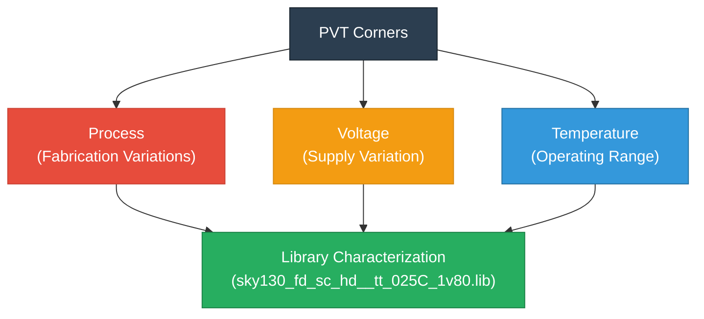

The library name `sky130_fd_sc_hd__tt_025C_1v80` decodes as:
| Segment | Meaning |
|:---|:---|
| `sky130` | SkyWater 130nm process |
| `fd_sc_hd` | Foundry, Standard Cell, High Density |
| `tt` | **Typical-Typical** process corner |
| `025C` | 25°C operating temperature |
| `1v80` | 1.80V supply voltage |

</details>

---

#### 4.1 Lab: Opening & Exploring the Liberty File

```bash
gvim ../my_lib/lib/sky130_fd_sc_hd__tt_025C_1v80.lib
```

<p align="center">
  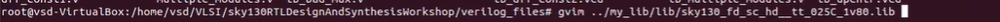
</p>

<p align="center">
  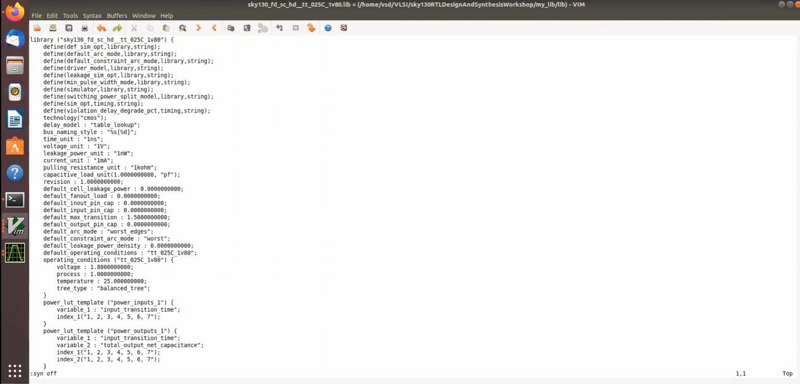
</p>

> **Key Library Parameters Observed:**
> | Parameter | Value | Significance |
> |:---|:---|:---|
> | `technology` | `"cmos"` | CMOS process technology |
> | `delay_model` | `"table_lookup"` | NLDM (Non-Linear Delay Model) |
> | `time_unit` | `1ns` | All timing in nanoseconds |
> | `voltage_unit` | `1V` | Voltage reference |
> | `leakage_power_unit` | `1nW` | Leakage power granularity |
> | `capacitive_load_unit` | `1pF` | Capacitance reference |
> | `operating_conditions` | `tt_025C_1v80` | Typical corner |

---

#### 4.2 Lab: Exploring Cell Definitions & Behavioral Models

Each standard cell in the `.lib` has a corresponding Verilog behavioral model:

<p align="center">
  
</p>

> **Observation:** The `sky130_fd_sc_hd__a2111o` cell implements `X = ((A1 & A2) | B1 | C1 | D1)`. The `.lib` entry contains **leakage power** values for every possible input combination, enabling accurate power estimation.

---

#### 4.3 Lab: Understanding Timing Arcs & Delay Tables

<p align="center">
  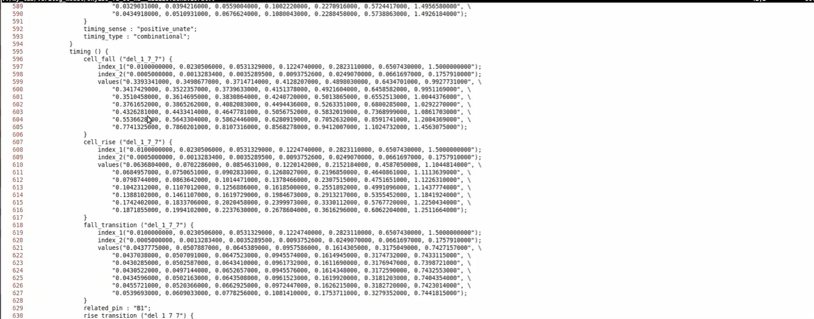
</p>

> **Timing Arc Analysis:**
> - **`cell_fall`** / **`cell_rise`**: 2D lookup tables indexed by `input_transition_time` × `total_output_net_capacitance`
> - **`fall_transition`** / **`rise_transition`**: Slew rate characterization tables
> - These NLDM tables enable the synthesis tool to accurately compute path delays for Static Timing Analysis (STA)

---

#### 4.4 Lab: Comparing Cell Flavors — Area vs. Power vs. Speed

<p align="center">
  
</p>

> **Comparative Analysis of `and2` Flavors:**
>
> | Cell Variant | Area | Leakage Power | Characteristic |
> |:---|:---|:---|:---|
> | `sky130_fd_sc_hd__and2_0` | 6.256 | 0.0019 nW | Smallest, slowest |
> | `sky130_fd_sc_hd__and2_2` | 7.507 | 0.0034 nW | Medium trade-off |
> | `sky130_fd_sc_hd__and2_4` | 8.758 | 0.0045 nW | Largest, fastest |
>
> ✅ Confirms the **area-power-speed trade-off**: larger cells have wider transistors, lower delay, but higher area and leakage.

---

### Lab 5 — Hierarchical vs. Flat Synthesis

> **Objective:** Understand the difference between hierarchical synthesis (preserving module boundaries) and flat synthesis (dissolving all hierarchy), and analyze their impact on the resulting netlist.

---

#### 5.1 Lab: Hierarchical Synthesis of `multiple_modules`

The design `multiple_modules.v` instantiates two sub-modules: `sub_module1` (AND gate) and `sub_module2` (OR gate).

```bash
yosys> read_liberty -lib ../my_lib/lib/sky130_fd_sc_hd__tt_025C_1v80.lib
yosys> read_verilog multiple_modules.v
yosys> synth -top multiple_modules
```

<p align="center">
  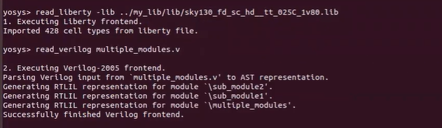
</p>

<p align="center">
  
</p>

> **Hierarchical Synthesis Statistics:**
>
> | Module | Cells | Cell Type |
> |:---|:---|:---|
> | `sub_module1` | 1 | `$_AND_` |
> | `sub_module2` | 1 | `$_OR_` |
> | **`multiple_modules` (top)** | **2** | `$_AND_` + `$_OR_` |
>
> **Design Hierarchy:** `multiple_modules` → `sub_module1` (u1) + `sub_module2` (u2)

---

#### 5.2 Lab: Viewing the Hierarchical Netlist Schematic

```bash
yosys> abc -liberty ../my_lib/lib/sky130_fd_sc_hd__tt_025C_1v80.lib
yosys> show multiple_modules
```

<p align="center">
  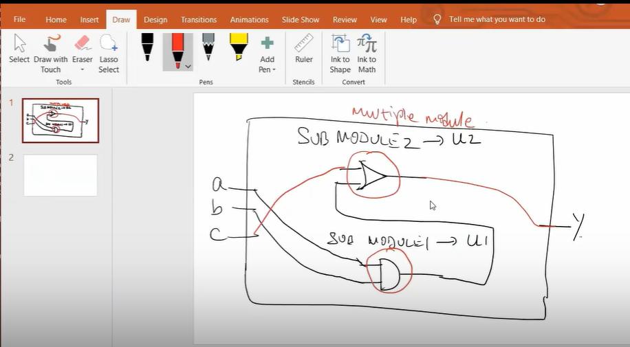
</p>

<p align="center">
  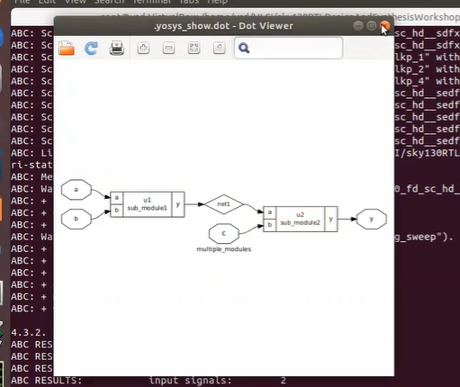
</p>

> **Observation:** In hierarchical synthesis, the sub-module boundaries are **preserved**. The schematic shows `u1 (sub_module1)` and `u2 (sub_module2)` as distinct blocks connected by `net1`. The internal implementation of each sub-module is mapped to Sky130 cells independently.

---

#### 5.3 Lab: Flat Synthesis & Netlist Comparison

After running `flatten` in Yosys, all module hierarchy is dissolved:

<p align="center">
  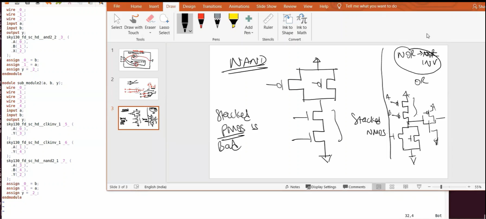
</p>

> **Key Observations from Flat Synthesis:**
> - The flat netlist uses `sky130_fd_sc_hd__and2_2` and `sky130_fd_sc_hd__clkinv_1` + `sky130_fd_sc_hd__nand2_1` cells
> - **No sub-module boundaries** — everything is at one level
> - The OR gate is implemented as **NAND(INV(a), INV(b))** — because NAND is preferred over NOR in CMOS (stacked PMOS is bad for performance)

<p align="center">
  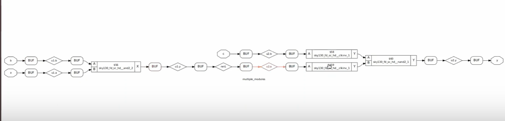
</p>

> **Flat vs. Hierarchical Schematic Comparison:**
>
> | Aspect | Hierarchical | Flat |
> |:---|:---|:---|
> | Module boundaries | Preserved | Dissolved |
> | Readability | Better for large designs | Single-level view |
> | Optimization | Per-module | Cross-module (global) |
> | Use case | IP reuse, debug | Final optimization |

---

#### 5.4 Lab: Sub-Module Level Synthesis

Yosys also supports synthesizing individual sub-modules independently:

<p align="center">
  
</p>

> **When to use sub-module synthesis:**
> - Very large designs where synthesizing the full top takes too long
> - When the same sub-module is instantiated multiple times (synthesize once, reuse the netlist)
> - For divide-and-conquer synthesis strategies in complex SoCs

---

### Lab 6 — Flip-Flop Coding Styles & Special Optimizations

> **Objective:** Explore different D flip-flop coding styles (asynchronous reset, asynchronous set, synchronous reset), simulate their behavior, synthesize them, and study special-case optimizations.

<details>
<summary><b>📖 Theory: Why Flip-Flops? — Combating Glitches in Combinational Logic</b></summary>
<br>

Combinational circuits produce **glitches** due to propagation delays through different signal paths. Flip-flops **shield** downstream logic by sampling data only on clock edges.

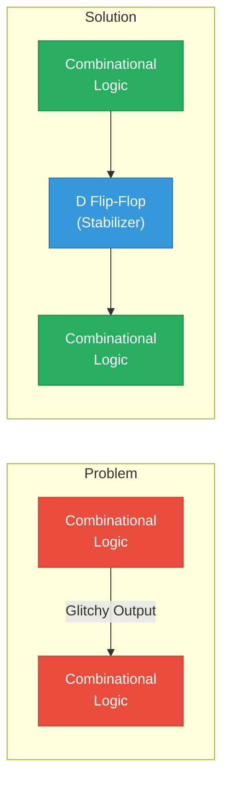

**Key Concepts:**
- **Asynchronous reset/set** → control signal is in the sensitivity list (`always @(posedge clk, posedge reset)`) → Yosys selects cells with dedicated async pins (`dfrtp_1`, `dfstp_1`)
- **Synchronous reset** → control signal is only checked inside the `if` block of `posedge clk` → Yosys uses a plain DFF + MUX at D input
- Reset/Set pins provide **known initialization states** to prevent undefined behavior at power-up

</details>

---

#### 6.1 RTL Source: Flip-Flop Coding Styles

<details>
<summary><b>📄 Asynchronous Reset DFF — <code>dff_asyncres.v</code></b></summary>

```verilog
module dff_asyncres (input clk, input async_reset, input d, output reg q);
  always @ (posedge clk, posedge async_reset)
  begin
    if (async_reset)
      q <= 1'b0;      // Reset immediately, regardless of clock
    else
      q <= d;
  end
endmodule
```
> `async_reset` is in the sensitivity list — the flop resets **immediately** when asserted, independent of the clock edge.
</details>

<details>
<summary><b>📄 Asynchronous Set DFF — <code>dff_async_set.v</code></b></summary>

```verilog
module dff_async_set (input clk, input async_set, input d, output reg q);
  always @ (posedge clk, posedge async_set)
  begin
    if (async_set)
      q <= 1'b1;      // Set to 1 immediately, regardless of clock
    else
      q <= d;
  end
endmodule
```
</details>

<details>
<summary><b>📄 Synchronous Reset DFF — <code>dff_syncres.v</code></b></summary>

```verilog
module dff_syncres (input clk, input sync_reset, input d, output reg q);
  always @ (posedge clk)
  begin
    if (sync_reset)
      q <= 1'b0;      // Reset only on the next clock edge
    else
      q <= d;
  end
endmodule
```
> Only `posedge clk` in the sensitivity list — reset is **synchronous** (evaluated on clock edges only).
</details>

---

#### 6.2 Theory: Async vs. Sync Reset Behavior

> **Key Differences:**
>
> | Feature | Asynchronous Reset | Synchronous Reset |
> |:---|:---|:---|
> | **Trigger** | Resets immediately on assertion | Resets on next clock edge |
> | **Sensitivity List** | `(posedge clk, posedge async_reset)` | `(posedge clk)` only |
> | **Circuit Implementation** | Reset goes to dedicated `RESET_B` pin | Reset feeds into a MUX before D pin |
> | **Use Case** | Power-on reset, safety-critical | Data-path controlled reset |

---

#### 6.3 Lab: Simulating Async Reset DFF — Waveform Analysis

```bash
iverilog dff_asyncres.v tb_dff_asyncres.v
./a.out
gtkwave tb_dff_asyncres.vcd
```

<p align="center">
  
</p>

> **Waveform Observation:** When `async_reset` goes HIGH, the output `q` drops to `0` **immediately** — not waiting for the next clock edge. When `async_reset` is LOW, `q` follows `d` on the rising edge of `clk`. ✅

---

#### 6.4 Lab: Simulating Sync Reset DFF — Waveform Analysis

```bash
iverilog dff_syncres.v tb_dff_syncres.v
./a.out
gtkwave tb_dff_syncres.vcd
```

<p align="center">
  
</p>

> **Waveform Observation:** When `sync_reset` goes HIGH, the output `q` only resets to `0` at the **next rising clock edge** — confirming synchronous behavior. The reset is sampled like regular data. ✅

---

#### 6.5 Lab: Synthesizing Async Reset DFF

```bash
yosys> read_liberty -lib ../my_lib/lib/sky130_fd_sc_hd__tt_025C_1v80.lib
yosys> read_verilog dff_asyncres.v
yosys> synth -top dff_asyncres
yosys> dfflibmap -liberty ../my_lib/lib/sky130_fd_sc_hd__tt_025C_1v80.lib
yosys> abc -liberty ../my_lib/lib/sky130_fd_sc_hd__tt_025C_1v80.lib
yosys> show
```

<p align="center">
  
</p>

<p align="center">
  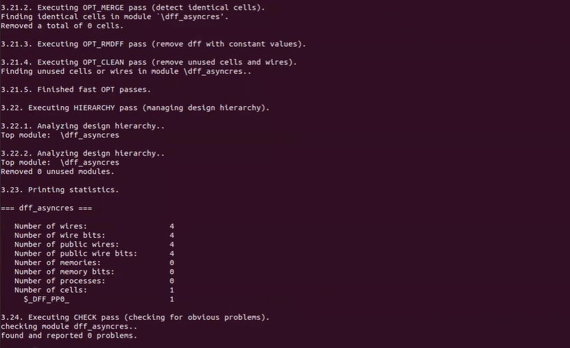
</p>

<p align="center">
  
</p>

> **Synthesis Result:**
> - Yosys infers a `$_DFF_PP0_` primitive (D flip-flop with active-high async reset)
> - Technology mapping selects **`sky130_fd_sc_hd__dfrtp_1`** — a D flip-flop with **active-low reset** (`RESET_B`)
> - An **inverter** (`sky130_fd_sc_hd__clkinv_1`) is inserted to convert the active-high `async_reset` to active-low `RESET_B`

---

#### 6.6 Lab: Synthesizing Async Set DFF

<p align="center">
  
</p>

> **Synthesis Result:**
> - Technology mapping selects **`sky130_fd_sc_hd__dfstp_2`** — a D flip-flop with **active-low set** (`SET_B`)
> - An inverter converts active-high `async_set` to `SET_B`
> - Confirms the library has dedicated **set** flops (not just reset flops)

---

#### 6.7 Theory: Combined Sync/Async Reset Circuits

> A design can combine **both** synchronous and asynchronous resets. In such cases:
> - The **async reset** connects directly to the flop's `RESET_B` pin
> - The **sync reset** feeds through a MUX at the D input, selecting between `1'b0` and the data
> - This creates a `dff_asyncres_syncres` topology: async for power-on safety, sync for datapath control

---

#### 6.8 Lab: Special Case Optimizations — Multiplier Synthesis

Yosys performs **constant propagation** and **algebraic optimization** for special arithmetic cases:

<p align="center">
  
</p>

> **`mul2`: Multiply by 2**
> ```verilog
> assign y = a * 2;  // Equivalent to: y = {a, 1'b0} — left shift by 1
> ```
> - **Result:** Zero standard cells needed! Yosys optimizes this to a simple **wire concatenation** (left-shift)
> - The `abc` pass reports: *"Extracted 0 gates and 0 wires — Don't call ABC as there is nothing to map"*

<p align="center">
  
</p>

> **`mult8`: Multiply by 8**
> ```verilog
> assign y = a * 8;  // Equivalent to: y = {a, 3'b000} — left shift by 3
> ```
> - **Result:** Again **zero cells** — pure wire routing optimization
> - Demonstrates that the synthesizer is smart enough to recognize powers-of-2 multiplications as bit-shifting operations

> **💡 Key Takeaway:** Not all operations require hardware! The synthesis tool applies algebraic optimizations to eliminate unnecessary logic, resulting in more efficient designs.

---

## 🔑 Key Learnings & Observations

### Synthesis Optimization using SKY130

The SKY130 standard cell library teaches us that **synthesis is not just translation** — it is optimization:

**1. Selecting Cells from RTL Semantics:**
Yosys infers the best-suited cell based on the coding style:
- Async reset → `dfrtp_1` (DFF with asynchronous reset pin)
- Async set → `dfstp_1` (DFF with asynchronous set pin)
- Sync reset → `dfxtp_1` + combinational MUX at D input

**2. Zero-Gate Arithmetic:**
Yosys performs algebraic optimization *before* technology mapping. `a * 2` and `a * 9` both result in **zero-gate/zero-area/zero-power** implementations — pure wire routing.

**3. MUX Inference:**
The `good_mux` with `always @(*) if-else` is properly inferred as a 2:1 multiplexer and directly mapped to `sky130_fd_sc_hd__mux2_1` — no decomposition to AND/OR/NOT gates.

**4. Hierarchical vs. Flat Trade-off:**
For `multiple_modules`, both flows produced identical gate counts (2 cells). However, in larger designs, flattening enables **cross-module constant propagation** that can drastically reduce cell count — at the cost of slower synthesis and reduced debuggability.

**5. The Importance of `abc`:**
The Boolean satisfiability and BDD optimizations in the ABC engine allow reducing logic cones before mapping to library cells. Synthesis without `abc -liberty` leads to significantly higher gate counts.

---

## ⚖️ Synthesis vs. Simulation — A Deep Comparison

| Dimension | Simulation (iverilog + GTKWave) | Synthesis (Yosys + SKY130) |
|:---|:---|:---|
| **Purpose** | Functional verification — does the RTL behave correctly? | Physical implementation — can this be built in silicon? |
| **Input** | Design `.v` + Testbench `.v` | Design `.v` + Liberty `.lib` |
| **Output** | `.vcd` waveform file | Gate-level netlist `.v` |
| **Timing Model** | Delta-cycle / zero-delay model | Technology-mapped with real cell delays |
| **Non-synthesizable Constructs** | Fully supported (`initial`, `#delay`, `$display`) | Ignored or errors — only synthesizable Verilog subset |
| **Optimization** | None — RTL executes as written | Aggressive — constant folding, dead code elimination, algebraic simplification |
| **Flip-Flop Inference** | Behavioral model (just a register) | Mapped to specific library cell (`dfrtp`, `dfxtp`, etc.) |
| **Latch Warning** | Simulation won't warn | Yosys warns: "Inferred latch for signal Y" |
| **What It Proves** | Correct logical behavior | Correct synthesizability and minimal gate count |

> **Golden Rule for RTL Design:** Just because something simulates correctly doesn't mean it will work in synthesis. Always **simulate AND synthesize**. A mismatch between simulation and synthesis results indicates either non-synthesizable constructs or a simulation-synthesis mismatch (SSM) problem.

---

## 🙏 Acknowledgements

- **[Kunal Ghosh](https://github.com/kunalg123)** — Co-founder, VSD Corp. Pvt. Ltd.
- **[VSD Squadron Program](https://www.vlsisystemdesign.com/)** — For providing the workshop platform, curated lab environment, and assessment framework
- **[SkyWater PDK](https://github.com/google/skywater-pdk)** — Open-source 130nm process design kit by Google & SkyWater Technology Foundry
- **[Yosys Open Synthesis Suite](https://github.com/YosysHQ/yosys)** — Open-source RTL synthesis framework by Clifford Wolf
- **[Icarus Verilog](http://iverilog.icarus.com/)** — Open-source Verilog simulation and synthesis tool
- **[GTKWave](http://gtkwave.sourceforge.net/)** — Open-source waveform viewer for VCD and other formats

---

<p align="center">
  <b>Assessment completed using: Icarus Verilog · GTKWave · Yosys 0.7 · SkyWater SKY130 PDK · Ubuntu (VSD VM)</b>
</p>

<p align="center">
  <i>This repository is part of the VSD Squadron Internship Assessment (12-Hour Lab). All lab work was performed on the official VSD workshop VM image.</i>
</p>

<p align="center">
  <b>⭐ If you found this documentation helpful, please consider starring this repository!</b>
</p>
