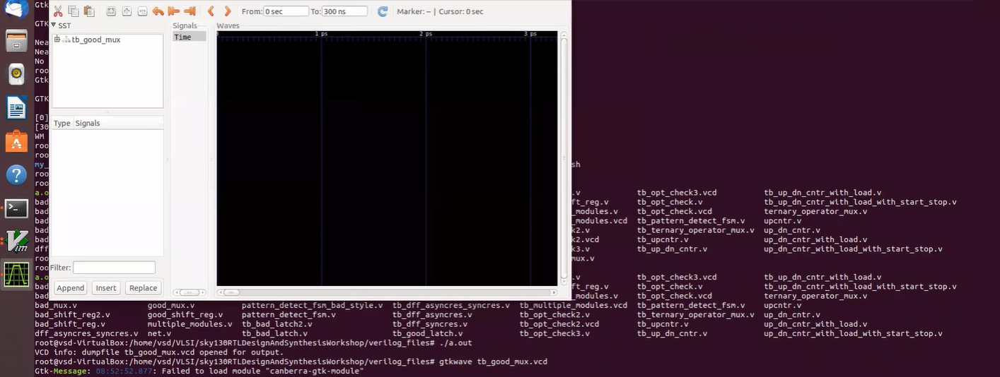
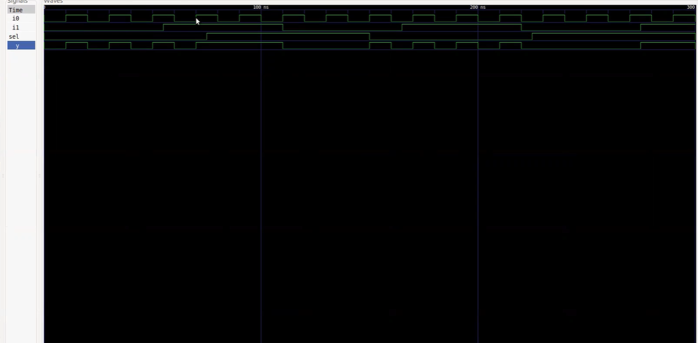
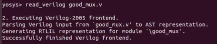
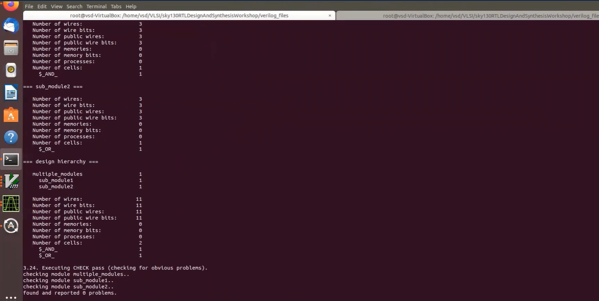
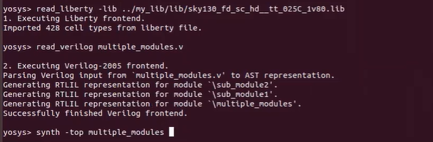
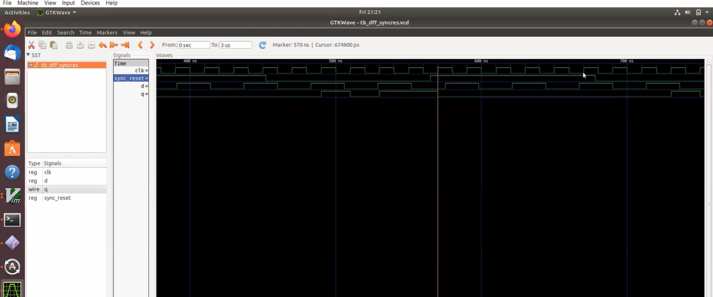
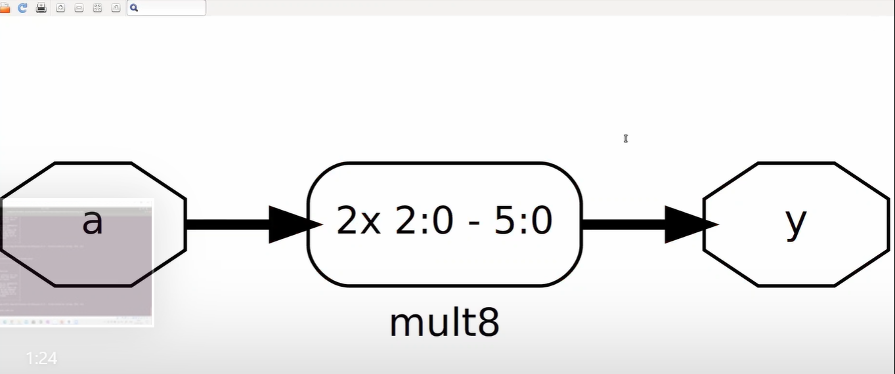

# VSD Squadron — RTL Design & Synthesis Assessment

> **Toolchain:** Icarus Verilog (Simulation) · GTKWave (Waveform Analysis) · Yosys (Synthesis) · SKY130 PDK (Standard Cell Library)

---

## Table of Contents
1. [Project Overview](#project-overview)
2. [Why Each File Type Matters](#why-each-file-type-matters)
3. [Lab Environment & Toolchain](#lab-environment--toolchain)
4. [Repository Structure](#repository-structure)
5. [File Index](#file-index)
6. [Lab 1 — 2:1 Multiplexer (`good_mux`)](#lab-1--21-multiplexer-good_mux)
7. [Lab 2 — Sky130 Liberty File Exploration](#lab-2--sky130-liberty-file-exploration)
8. [Lab 3 — Multiple Modules: Hierarchy vs Flatten vs Submodule](#lab-3--multiple-modules-hierarchy-vs-flatten-vs-submodule)
9. [Lab 4 — D Flip-Flops: Three Reset/Set Variants](#lab-4--d-flip-flops-three-resetset-variants)
10. [Lab 5 — Special Case Arithmetic: Zero-Gate Multipliers](#lab-5--special-case-arithmetic-zero-gate-multipliers)
11. [Key Learnings & Observations](#key-learnings--observations)
12. [Synthesis vs. Simulation — A Deep Comparison](#synthesis-vs-simulation--a-deep-comparison)
13. [Acknowledgements](#acknowledgements)

---

## Project Overview

This repository documents the complete output of a **12-hour hands-on RTL Design and Synthesis assessment** conducted as part of the **VSD (VLSI System Design) Squadron Internship**. The assessment covers the full ASIC front-end design flow:

- **RTL Coding** — Writing synthesizable Verilog HDL code to describe the intended behavior of the hardware design.
- **Functional Simulation** — Compilation of the design and testbench using Icarus Verilog followed by generation of Value Change Dump (`.vcd`) files.
- **Waveform Analysis** — Viewing the `.vcd` file in GTKWave for visual inspection and validation of signal transitions.
- **Logic Synthesis** — Inputting the RTL code together with the SkyWater SKY130 standard cell library into Yosys to generate a gate-level netlist.

The design modules intentionally cover different synthesis paradigms — combinational logic, hierarchical vs. flat netlists, sequential circuits with various reset styles, and arithmetic optimizations — providing a comprehensive view of front-end ASIC methodology.

---

## Why Each File Type Matters

Understanding **why** each file type exists is as important as knowing **how** to use it. Every extension in this project serves a distinct purpose in the design verification and synthesis flow.

| Extension | Full Name | Role in the Flow | Why We Need It |
|-----------|-----------|-----------------|----------------|
| `.v` | Verilog Source File | RTL Design / Testbench | The primary input — describes hardware behavior in synthesizable Verilog. **Design files** model the circuit; **testbench files** (`tb_*`) generate stimulus. |
| `.vcd` | Value Change Dump | Simulation Output | Records every signal transition with a timestamp. Without this, GTKWave has nothing to display — it bridges simulation and visualization. |
| `.ys` | Yosys Script | Synthesis Automation | Sequences synthesis commands (`read_verilog`, `synth`, `abc`, `write_verilog`). Ensures reproducibility and makes the pipeline version-controllable. |
| `.lib` | Liberty File | Standard Cell Library | Contains timing, area, and power data for real foundry cells. Maps abstract RTL operators to physical gates. |
| `.png` | Screenshots | Documentation Evidence | GTKWave waveform captures and Yosys schematics serve as **visual proof** of correct behavior and synthesis topology. |

```
design.v + tb_design.v  →  iverilog  →  a.out  →  ./a.out  →  design.vcd  →  GTKWave
design.v                →  Yosys + sky130.lib   →  gate_level_netlist.v  +  schematic
```

> **Key Insight:** RTL Simulation is proof that the RTL "works." RTL Synthesis is proof that the RTL "builds." Both are essential — an RTL can simulate successfully but fail to synthesize due to non-synthesizable constructs (`#delay`, `initial` blocks in DUT, etc.).

---

## Lab Environment & Toolchain

All labs were performed on a pre-configured **VSD VirtualBox VM** running Ubuntu.

### Icarus Verilog (iverilog + vvp)
Icarus Verilog is an open-source Verilog compiler. It works in two stages:
- `iverilog -o sim design.v tb_design.v` — compiles both files into a simulation executable.
- `./sim` (or `vvp sim`) — runs the simulation and writes the `.vcd` file.

> The testbench is **not synthesized** — it exists purely to drive stimulus into the DUT (Device Under Test). This is why testbenches can freely use `initial` blocks and `#delay` constructs that would be illegal in real RTL.

### GTKWave
GTKWave is a waveform viewer that accepts `.vcd` files, allowing engineers to:
- Verify output waveforms toggle correctly based on clock edges
- Confirm asynchronous behavior takes precedence over synchronous behavior
- Check that combinational outputs change instantly upon input change

### Yosys Open Synthesis Suite
Yosys is an open-source RTL synthesis framework. The standard synthesis flow:

```tcl
read_verilog design.v                        # Parse RTL
synth -top module_name                       # High-level synthesis
dfflibmap -liberty sky130.lib                # Map flip-flops to library cells
abc -liberty sky130.lib                      # Map combinational logic (ABC engine)
show                                         # Display schematic
write_verilog -noattr netlist.v              # Write gate-level netlist
```

### SKY130 Standard Cell Library
The SkyWater SKY130 is a 130nm open-source PDK defining real logic cells:
- `sky130_fd_sc_hd__and2_1` — 2-input AND gate
- `sky130_fd_sc_hd__or2_1` — 2-input OR gate
- `sky130_fd_sc_hd__mux2_1` — 2:1 Multiplexer
- `sky130_fd_sc_hd__dfrtp_1` — D Flip-Flop with async Reset
- `sky130_fd_sc_hd__dfstp_1` — D Flip-Flop with async Set

> Using a real PDK means the synthesized netlist reflects **actual silicon area and timing**, not an abstract model.

---

## Repository Structure

```
VSD_INTERN_ASSESSMENT/
│
├── rtl/                                ← RTL design source files
│   ├── good_mux.v
│   ├── multiple_modules.v
│   ├── dff_asyncres.v
│   ├── dff_async_set.v
│   ├── dff_syncres.v
│   ├── mult_2.v
│   └── mult_8.v
│
├── tb/                                 ← Testbench files
│   ├── tb_good_mux.v
│   ├── tb_dff_asyncres.v
│   ├── tb_dff_async_set.v
│   └── tb_dff_syncres.v
│
├── scripts/                            ← Yosys synthesis scripts
│   ├── good_mux.ys
│   ├── multiple_modules_hier.ys
│   ├── multiple_modules_flat.ys
│   ├── sub_module1.ys
│   ├── dff_asyncres.ys
│   ├── dff_async_set.ys
│   ├── dff_syncres.ys
│   ├── mul2.ys
│   └── mult8.ys
│
├── results/                            ← All screenshots referenced in this README
│   ├── part_11.png ... part92.png      ← Lab 1 (MUX simulation & synthesis)
│   ├── lib_1.png ... lib_6.png         ← Lab 2 (Liberty file exploration)
│   ├── hier_1.png ... hier_8.png       ← Lab 3 (Hierarchical/flat synthesis)
│   └── flop_5.png ... flop_13.png      ← Lab 4–5 (DFFs & multipliers)
│
└── README.md
```

---

## File Index

### Design Source Files
| File | Module Name | Type | Function |
|------|-------------|------|----------|
| `good_mux.v` | `good_mux` | Combinational | 2:1 Multiplexer — selects between `i0` and `i1` based on `sel` |
| `multiple_modules.v` | `multiple_modules`, `sub_module1`, `sub_module2` | Combinational (Hierarchy) | Top-level module instantiating AND + OR gates as sub-modules |
| `dff_asyncres.v` | `dff_asyncres` | Sequential | D Flip-Flop with **asynchronous reset** (active-high, resets to 0) |
| `dff_async_set.v` | `dff_async_set` | Sequential | D Flip-Flop with **asynchronous set** (active-high, sets to 1) |
| `dff_syncres.v` | `dff_syncres` | Sequential | D Flip-Flop with **synchronous reset** (clocked, resets to 0) |
| `mult_2.v` | `mul2` | Combinational | Multiplies 3-bit input by 2 — synthesizes to **zero logic cells** |
| `mult_8.v` | `mult8` | Combinational | Multiplies 3-bit input by 9 — synthesizes to **zero logic cells** |

### Testbench Files
| File | Tests Module | Sim Duration | Key Stimulus |
|------|-------------|--------------|--------------|
| `tb_good_mux.v` | `good_mux` | 300 ns | `sel` every 75 ns, `i0` every 10 ns, `i1` every 55 ns |
| `tb_dff_asyncres.v` | `dff_asyncres` | 3000 ns | Clock 20 ns period, `d` every 23 ns, `async_reset` every 547 ns |
| `tb_dff_async_set.v` | `dff_async_set` | 3000 ns | Clock 20 ns period, `d` every 23 ns, `async_set` every 547 ns |
| `tb_dff_syncres.v` | `dff_syncres` | 3000 ns | Clock 20 ns period, `d` every 23 ns, `sync_reset` every 113 ns |

---

## Lab 1 — 2:1 Multiplexer (`good_mux`)

### 1.1 RTL Description

```verilog
// good_mux.v
module good_mux (input i0, input i1, input sel, output reg y);
  always @ (*)
  begin
    if (sel)
      y <= i1;
    else
      y <= i0;
  end
endmodule
```

**Code Walkthrough:**

- `always @ (*)` — The wildcard sensitivity list triggers evaluation on **any** input change. This is the correct way to code combinational logic; writing `always @ (sel)` would ignore changes on `i0`/`i1`, causing a simulation-synthesis mismatch.
- `output reg y` — Despite the MUX being combinational, `y` is declared `reg` because it is assigned inside an `always` block. This does **not** infer a flip-flop — Yosys generates a pure combinational path from `always @(*)`.
- The `if-else` structure maps directly to a 2:1 MUX by all synthesis tools.

**Testbench Stimulus (`tb_good_mux.v`):**

```verilog
always #75  sel = ~sel;   // sel changes every 75 ns
always #10  i0  = ~i0;    // i0 changes every 10 ns (fastest toggle)
always #55  i1  = ~i1;    // i1 changes every 55 ns
```

The three inputs toggle at different frequencies, ensuring all 8 combinations of `{sel, i0, i1}` are covered within the 300 ns window. Waveform data is captured via `$dumpfile` and `$dumpvars(0, tb_good_mux)`.

### 1.2 Environment Setup & File Listing


The `verilog_files/` directory on the VSD VM contains a comprehensive set of RTL designs (`.v`), their testbenches (`tb_*.v`), and supporting files.

### 1.3 Simulation

**Terminal Output:**


The terminal confirms the two-step simulation workflow:
1. `iverilog good_mux.v tb_good_mux.v` — compiles both files. No errors confirms syntactically correct RTL.
2. `./a.out` — executes the simulation and writes `tb_good_mux.vcd`.

**GTKWave Waveform — Signal Tree:**



**GTKWave Waveform — Full View:**



Key observations from the waveform:
- When `sel = 0`, output `y` tracks `i0` exactly (10 ns toggle period).
- When `sel = 1`, output `y` tracks `i1` exactly (55 ns toggle period).
- Transitions are **instantaneous** — no glitches or undefined states, confirming correct combinational behavior.

**RTL & Testbench Source Code:**


### 1.4 Synthesis

**Yosys Invocation:**


**Reading the Sky130 Liberty File:**


Yosys loads the `sky130_fd_sc_hd` library at the **TT corner** (Typical-Typical), 25°C, 1.80V. **428 standard cell types** are imported.

**Yosys Synthesis Script:**

```tcl
read_liberty -lib ../my_lib/lib/sky130_fd_sc_hd__tt_025C_1v80.lib
read_verilog good_mux.v
synth -top good_mux
abc -liberty ../my_lib/lib/sky130_fd_sc_hd__tt_025C_1v80.lib
show
write_verilog -noattr good_mux_netlist.v
```

**Reading Verilog:**



**Running Synthesis:**


**Synthesis Statistics:**


| Metric | Value |
|:---|:---|
| Number of wires | 4 |
| Number of cells | **1 (`$_MUX_`)** |

Yosys correctly infers the design as a **single MUX primitive** — proving an optimal one-cell solution.

### 1.5 Block Diagram


The synthesized `good_mux` uses three Sky130 cells in an optimized decomposition:

| Cell Instance | Standard Cell | Function |
|:---|:---|:---|
| `$53` | `sky130_fd_sc_hd__clkinv_1` | Inverter (inverts `sel`) |
| `$54` | `sky130_fd_sc_hd__nand2_1` | 2-input NAND gate |
| `$55` | `sky130_fd_sc_hd__o21ai_0` | OR-AND-Invert complex gate |

This implements `y = (sel · i1) + (sel' · i0)` using an optimized gate decomposition. No flip-flops, buffers, or latches — a perfect combinational design.

### 1.6 Gate-Level Netlist

**Writing Netlist:**


**Generated Netlist Source:**


```verilog
/* Generated by Yosys 0.7 */
module good_mux(i0, i1, sel, y);
  wire _0_, _1_, _2_, _3_, _4_, _5_;
  input i0, i1, sel;
  output y;

  sky130_fd_sc_hd__clkinv_1 _6_ (.A(_0_), .Y(_4_));
  sky130_fd_sc_hd__nand2_1  _7_ (.A(_1_), .B(_2_), .Y(_5_));
  sky130_fd_sc_hd__o21ai_0  _8_ (.A1(_2_), .A2(_4_), .B1(_5_), .Y(_3_));

  assign _0_ = i0;
  assign _1_ = i1;
  assign _2_ = sel;
  assign y   = _3_;
endmodule
```

The netlist is **structural Verilog** using instantiated Sky130 cells — functionally equivalent to the behavioral RTL and ready for Gate-Level Simulation (GLS), Place & Route, and Static Timing Analysis.

---

## Lab 2 — Sky130 Liberty File Exploration

The `.lib` (Liberty) file is the foundation of technology-mapped synthesis. It contains timing, area, and power characterization for every standard cell. Understanding its internals is essential for interpreting synthesis results.

### 2.1 PVT Corners & Library Naming

Standard cell libraries are characterized across **PVT (Process, Voltage, Temperature)** corners. The library name `sky130_fd_sc_hd__tt_025C_1v80` decodes as:

| Segment | Meaning |
|:---|:---|
| `sky130` | SkyWater 130nm process |
| `fd_sc_hd` | Foundry, Standard Cell, High Density |
| `tt` | **Typical-Typical** process corner |
| `025C` | 25°C operating temperature |
| `1v80` | 1.80V supply voltage |

### 2.2 Opening the Liberty File

```bash
gvim ../my_lib/lib/sky130_fd_sc_hd__tt_025C_1v80.lib
```


**Key Library Parameters:**

| Parameter | Value | Significance |
|:---|:---|:---|
| `technology` | `"cmos"` | CMOS process technology |
| `delay_model` | `"table_lookup"` | NLDM (Non-Linear Delay Model) |
| `time_unit` | `1ns` | All timing in nanoseconds |
| `voltage_unit` | `1V` | Voltage reference |
| `leakage_power_unit` | `1nW` | Leakage power granularity |
| `capacitive_load_unit` | `1pF` | Capacitance reference |
| `operating_conditions` | `tt_025C_1v80` | Typical corner |

### 2.3 Cell Definitions & Behavioral Models

Each standard cell has a Verilog behavioral model and complete characterization data:


The `sky130_fd_sc_hd__a2111o` cell implements `X = ((A1 & A2) | B1 | C1 | D1)`. The `.lib` entry contains **leakage power** values for every possible input combination, enabling accurate power estimation.

### 2.4 Timing Arcs & Delay Tables


- **`cell_fall`** / **`cell_rise`**: 2D lookup tables indexed by `input_transition_time` × `total_output_net_capacitance`
- **`fall_transition`** / **`rise_transition`**: Slew rate characterization tables
- These NLDM tables enable accurate path delay computation for Static Timing Analysis (STA)

### 2.5 Comparing Cell Flavors — Area vs. Power vs. Speed


| Cell Variant | Area | Leakage Power | Characteristic |
|:---|:---|:---|:---|
| `sky130_fd_sc_hd__and2_0` | 6.256 | 0.0019 nW | Smallest, slowest |
| `sky130_fd_sc_hd__and2_2` | 7.507 | 0.0034 nW | Medium trade-off |
| `sky130_fd_sc_hd__and2_4` | 8.758 | 0.0045 nW | Largest, fastest |

This confirms the **area-power-speed trade-off**: larger cells have wider transistors, lower delay, but higher area and leakage.

> **Why do we need BOTH fast and slow cells?**
> - **Fast cells** meet **setup time** requirements: `T_setup < T_clk - T_CQ - T_COMBI`
> - **Slow cells** prevent **hold time** violations: `T_HOLD < T_CQ + T_COMBI`
> - The `.lib` provides both so the synthesizer can balance these during timing closure.

---

## Lab 3 — Multiple Modules: Hierarchy vs Flatten vs Submodule

This lab demonstrates three distinct synthesis strategies for the same design and shows how each affects the resulting netlist and schematic.

### 3.1 RTL Description

```verilog
// multiple_modules.v
module sub_module2 (input a, input b, output y);
  assign y = a | b;          // OR gate
endmodule

module sub_module1 (input a, input b, output y);
  assign y = a & b;          // AND gate
endmodule

module multiple_modules (input a, input b, input c, output y);
  wire net1;
  sub_module1 u1 (.a(a), .b(b), .y(net1));   // net1 = a & b
  sub_module2 u2 (.a(net1), .b(c), .y(y));   // y = net1 | c = (a & b) | c
endmodule
```

**Code Walkthrough:**
- `sub_module1` implements a 2-input **AND gate** using continuous assignment.
- `sub_module2` implements a 2-input **OR gate** using continuous assignment.
- `multiple_modules` instantiates both. Instance `u1` feeds output `net1` to `u2`. Overall: `y = (a & b) | c`.

### 3.2 Hierarchical Synthesis

In hierarchical synthesis, Yosys **preserves the module boundaries**. Each sub-module is synthesized as a separate entity.

```tcl
read_liberty -lib ../my_lib/lib/sky130_fd_sc_hd__tt_025C_1v80.lib
read_verilog multiple_modules.v
synth -top multiple_modules
abc -liberty ../my_lib/lib/sky130_fd_sc_hd__tt_025C_1v80.lib
show multiple_modules
write_verilog -noattr multiple_modules_hier.v
```

**Terminal Output:**


**Synthesis Statistics:**



| Module | Cells | Cell Type |
|:---|:---|:---|
| `sub_module1` | 1 | `$_AND_` |
| `sub_module2` | 1 | `$_OR_` |
| **`multiple_modules` (top)** | **2** | `$_AND_` + `$_OR_` |

**Block Diagram — Hierarchical:**


The hierarchical schematic shows `u1 (sub_module1)` and `u2 (sub_module2)` as distinct blocks connected by `net1`. Module hierarchy is **fully retained**.

### 3.3 Flattened Synthesis

The `flatten` command **dissolves all module boundaries** into a single-level netlist.

```tcl
read_verilog multiple_modules.v
synth -top multiple_modules
flatten                            # ← KEY DIFFERENCE
abc -liberty ../my_lib/lib/sky130_fd_sc_hd__tt_025C_1v80.lib
show
write_verilog -noattr multiple_modules_flat.v
```

**Block Diagram — Flattened:**


Key differences from hierarchical:
- **No sub-module boundaries** — everything at a single level.
- The OR gate is implemented as **NAND(INV(a), INV(b))** — because NAND gates are preferred over NOR in CMOS (stacked PMOS in NOR gates have poor mobility, making them slower and larger).

**Hierarchical vs. Flattened Comparison:**

| Aspect | Hierarchical | Flattened |
|--------|-------------|-----------|
| **Module Boundaries** | Preserved | Dissolved |
| **Optimization Scope** | Per-module (local) | Cross-boundary (global) |
| **Cross-module Optimization** | Not possible | ABC optimizes across boundaries |
| **Incremental Re-synthesis** | Re-synth only changed module | Full re-synthesis required |
| **Use Case** | Large designs, IP reuse | Small designs, max optimization |
| **Debugging** | Easier — trace to module | Harder — no hierarchy |

> **Critical Insight:** For this small design (2 cells), both flows produce identical gate counts. The real difference emerges in large designs where cross-module constant propagation can drastically reduce cell count after flattening.

### 3.4 Submodule-Only Synthesis

Yosys can synthesize **only a single sub-module** by specifying it as the top:

```tcl
read_verilog multiple_modules.v
synth -top sub_module1             # ← Synthesizes ONLY sub_module1
abc -liberty ../my_lib/lib/sky130_fd_sc_hd__tt_025C_1v80.lib
show
```



This strategy is used when:
- The design is too large for monolithic synthesis
- The same sub-module is instantiated multiple times — synthesize once, reuse
- Isolating a problematic module for focused investigation

---

## Lab 4 — D Flip-Flops: Three Reset/Set Variants

Sequential logic synthesis is fundamentally different from combinational. A flip-flop represents **state** — it holds its value between clock cycles. The type of reset/set mechanism directly determines which SKY130 cell Yosys selects.

### Why DFFs Matter in Synthesis

Whenever Yosys finds a `reg` assigned inside `always @(posedge clk)`, it infers a flip-flop. The **cell chosen from SKY130** depends on the control signal:

- **Asynchronous reset/set** → control signal in sensitivity list → Yosys selects cells with dedicated async pins (`dfrtp_1`, `dfstp_1`)
- **Synchronous reset** → control signal checked only inside `if` block → Yosys uses a plain DFF + MUX at D input

### 4.1 Asynchronous Reset DFF (`dff_asyncres`)

```verilog
// dff_asyncres.v
module dff_asyncres (input clk, input async_reset, input d, output reg q);
  always @ (posedge clk, posedge async_reset)
  begin
    if (async_reset)
      q <= 1'b0;      // Reset immediately, regardless of clock
    else
      q <= d;
  end
endmodule
```

**Code Walkthrough:**

- `always @(posedge clk, posedge async_reset)` — Two events in the sensitivity list. This is **asynchronous control**.
- `if (async_reset) q <= 1'b0` — When `async_reset` asserts, `q` resets to 0 **instantly**, independent of the clock.
- `else q <= d` — On normal rising clock edges (without reset), `q` takes the value of `d`.

**Testbench Stimulus:**

```verilog
always #10  clk         = ~clk;         // 20 ns clock period
always #23  d           = ~d;           // data changes asynchronously
always #547 async_reset = ~async_reset; // long reset pulses
```

The long reset period (547 ns) ensures multiple clock cycles both inside and outside the reset window.

**Simulation — GTKWave Waveform:**


When `async_reset` goes HIGH, `q` drops to `0` **immediately** — not waiting for the next clock edge. When `async_reset` is LOW, `q` follows `d` on each rising edge of `clk`. ✅

**Synthesis — Terminal Output:**


**Synthesis — Block Diagram:**


**Synthesis Result:**
- Yosys infers a `$_DFF_PP0_` primitive (D flip-flop with active-high async reset)
- Technology mapping selects **`sky130_fd_sc_hd__dfrtp_1`** — a DFF with **active-low reset** (`RESET_B`)
- An **inverter** (`sky130_fd_sc_hd__clkinv_1`) converts active-high `async_reset` to active-low `RESET_B`
- No extra combinational logic needed — reset functionality is **inherent to the cell itself**

---

### 4.2 Asynchronous Set DFF (`dff_async_set`)

```verilog
// dff_async_set.v
module dff_async_set (input clk, input async_set, input d, output reg q);
  always @ (posedge clk, posedge async_set)
  begin
    if (async_set)
      q <= 1'b1;      // Set to 1 immediately, regardless of clock
    else
      q <= d;
  end
endmodule
```

Structurally identical to `dff_asyncres` except: when asserted, `q` is forced to `1'b1` (logic HIGH) instead of `1'b0`.

**Synthesis — Block Diagram:**


**Synthesis Result:**
- Technology mapping selects **`sky130_fd_sc_hd__dfstp_2`** — a DFF with **active-low set** (`SET_B`)
- An inverter converts active-high `async_set` to `SET_B`
- Confirms the library has dedicated **set** flops (not just reset flops)

---

### 4.3 Synchronous Reset DFF (`dff_syncres`)

```verilog
// dff_syncres.v
module dff_syncres (input clk, input sync_reset, input d, output reg q);
  always @ (posedge clk)          // ← ONLY clock in sensitivity list
  begin
    if (sync_reset)
      q <= 1'b0;      // Reset only on the next clock edge
    else
      q <= d;
  end
endmodule
```

**Code Walkthrough:**

- `always @ (posedge clk)` — Only **one event** in the sensitivity list. All actions are **synchronous**.
- `if (sync_reset)` — The reset is examined only during clock edges. Even if `sync_reset` becomes active mid-cycle, `q` changes only at the next rising edge.

**Simulation — GTKWave Waveform:**



When `sync_reset` goes HIGH, `q` only resets to `0` at the **next rising clock edge** — confirming synchronous behavior. The reset is sampled like regular data. ✅

---

### 4.4 Three-Way DFF Comparison

| Feature | Async Reset | Async Set | Sync Reset |
|---------|-------------|-----------|------------|
| **Sensitivity List** | `posedge clk, posedge reset` | `posedge clk, posedge set` | `posedge clk` only |
| **Reset Timing** | Immediate (clock-independent) | Immediate (clock-independent) | Next clock edge only |
| **SKY130 Cell** | `dfrtp_1` (DFF + async reset) | `dfstp_2` (DFF + async set) | `dfxtp_1` + MUX |
| **Output on Assert** | `q → 0` | `q → 1` | `q → 0` (on next clk) |
| **Extra Logic** | None (inverter only) | None (inverter only) | MUX at D input |
| **Timing Analysis** | Needs false path constraints | Needs false path constraints | Naturally timed by STA |
| **Glitch Risk** | Higher (async) | Higher (async) | None (synchronous) |

---

## Lab 5 — Special Case Arithmetic: Zero-Gate Multipliers

This lab demonstrates one of the most important optimizations in digital design: **recognizing that certain arithmetic operations require zero logic gates**.

### 5.1 Multiply by 2 (`mul2`)

```verilog
// mult_2.v
module mul2 (input [2:0] a, output [3:0] y);
  assign y = a * 2;
endmodule
```

**Code Walkthrough:**

- `input [2:0] a` — 3-bit input (values 0–7).
- `output [3:0] y` — 4-bit output (max: 7 × 2 = 14, needs 4 bits).
- `a * 2` in binary is a **left shift by 1**:

```
If a = {a[2], a[1], a[0]}
Then a * 2 = {a[2], a[1], a[0], 0}    ← Just append a zero at LSB
```

No gates needed — only **wire connections**.

**Synthesis — Yosys Output & Block Diagram:**


**Result:** `Number of cells: 0`. Yosys optimizes this to a simple wire concatenation. The `abc` pass reports: *"Don't call ABC as there is nothing to map"* — the entire "multiplier" is just routing.

---

### 5.2 Multiply by 9 (`mult8`)

```verilog
// mult_8.v
module mult8 (input [2:0] a, output [5:0] y);
  assign y = a * 9;
endmodule
```

**Code Walkthrough:**

- `output [5:0] y` — 6-bit output (max: 7 × 9 = 63, needs 6 bits).
- The key insight: `9 = 8 + 1`, so:

```
a * 9 = a * (8 + 1)
      = (a * 8) + (a * 1)
      = (a << 3) + a
      = {a, 3'b000} + {3'b000, a}

Since a is 3 bits:
  {a[2],a[1],a[0], 0, 0, 0}
+ {  0,  0,  0, a[2],a[1],a[0]}
= {a[2],a[1],a[0], a[2],a[1],a[0]}
= {a, a}    ← Just concatenate a with itself!
```

**Synthesis — Yosys Output & Block Diagram:**



**Result:** Again `Number of cells: 0`. Yosys recognizes `a * 9` as `{a, a}` — pure wire routing, zero gates.

**Multiply Comparison:**

| Aspect | `mul2` (×2) | `mult8` (×9) |
|--------|------------|--------------|
| **Mathematical Trick** | `a × 2 = a << 1` | `a × 9 = a × (8+1) = {a, a}` |
| **Output Width** | 4 bits | 6 bits |
| **Gates Synthesized** | 0 | 0 |
| **Implementation** | `{a, 1'b0}` | `{a, a}` (concatenation) |
| **SKY130 Cells Used** | None | None |

> **Key Takeaway:** Not all operations require hardware! The synthesis tool applies algebraic optimizations to eliminate unnecessary logic, resulting in zero-area, zero-power implementations.

---

## Key Learnings & Observations

### Synthesis Optimization using SKY130

The SKY130 standard cell library teaches us that **synthesis is not just translation** — it is optimization:

**1. Selecting Cells from RTL Semantics:**
Yosys infers the best-suited cell based on the coding style:
- Async reset → `dfrtp_1` (DFF with asynchronous reset pin)
- Async set → `dfstp_2` (DFF with asynchronous set pin)
- Sync reset → `dfxtp_1` + combinational MUX at D input

**2. Zero-Gate Arithmetic:**
Yosys performs algebraic optimization *before* technology mapping. `a * 2` and `a * 9` both result in **zero-gate/zero-area/zero-power** implementations — pure wire routing.

**3. MUX Inference:**
The `good_mux` with `always @(*) if-else` is properly inferred as a 2:1 multiplexer — no decomposition to AND/OR/NOT gates required.

**4. Hierarchical vs. Flat Trade-off:**
For `multiple_modules`, both flows produced identical gate counts (2 cells). However, in larger designs, flattening enables **cross-module constant propagation** that can drastically reduce cell count — at the cost of slower synthesis and reduced debuggability.

**5. The Importance of `abc`:**
The Boolean satisfiability and BDD optimizations in the ABC engine reduce logic cones before mapping to library cells. Synthesis without `abc -liberty` leads to significantly higher gate counts.

---

## Synthesis vs. Simulation — A Deep Comparison

| Dimension | Simulation (iverilog + GTKWave) | Synthesis (Yosys + SKY130) |
|-----------|--------------------------------|---------------------------|
| **Purpose** | Functional verification — does the RTL behave correctly? | Physical implementation — can this be built in silicon? |
| **Input** | Design `.v` + Testbench `.v` | Design `.v` + Liberty `.lib` |
| **Output** | `.vcd` waveform file | Gate-level netlist `.v` |
| **Timing Model** | Delta-cycle / zero-delay model | Technology-mapped with real cell delays |
| **Non-synthesizable Constructs** | Fully supported (`initial`, `#delay`, `$display`) | Ignored or errors — only synthesizable subset |
| **Optimization** | None — RTL executes as written | Aggressive — constant folding, dead code elimination |
| **Flip-Flop Inference** | Behavioral model (just a register) | Mapped to specific library cell (`dfrtp`, `dfxtp`, etc.) |
| **Latch Warning** | Simulation won't warn | Yosys warns: "Inferred latch for signal Y" |
| **What It Proves** | Correct logical behavior | Correct synthesizability and minimal gate count |

> **Golden Rule:** Just because something simulates correctly doesn't mean it will synthesize. Always **simulate AND synthesize**. A mismatch indicates either non-synthesizable constructs or a simulation-synthesis mismatch (SSM) problem.

---

## Acknowledgements

- **[Kunal Ghosh](https://github.com/kunalg123)** — Co-founder, VSD Corp. Pvt. Ltd.
- **[VSD Squadron Program](https://www.vlsisystemdesign.com/)** — Assessment platform, curated lab environment, and framework
- **[SkyWater PDK](https://github.com/google/skywater-pdk)** — Open-source 130nm PDK by Google & SkyWater Technology Foundry
- **[Yosys Open Synthesis Suite](https://github.com/YosysHQ/yosys)** — Open-source RTL synthesis framework by Clifford Wolf
- **[Icarus Verilog](http://iverilog.icarus.com/)** — Open-source Verilog simulation and synthesis tool
- **[GTKWave](http://gtkwave.sourceforge.net/)** — Open-source waveform viewer

---

*Assessment completed using: Icarus Verilog · GTKWave · Yosys 0.7 · SkyWater SKY130 PDK · Ubuntu (VSD VM)*

*This repository is part of the VSD Squadron Internship Assessment (12-Hour Lab). All lab work was performed on the official VSD workshop VM image.*

**⭐ If you found this documentation helpful, please consider starring this repository!**
